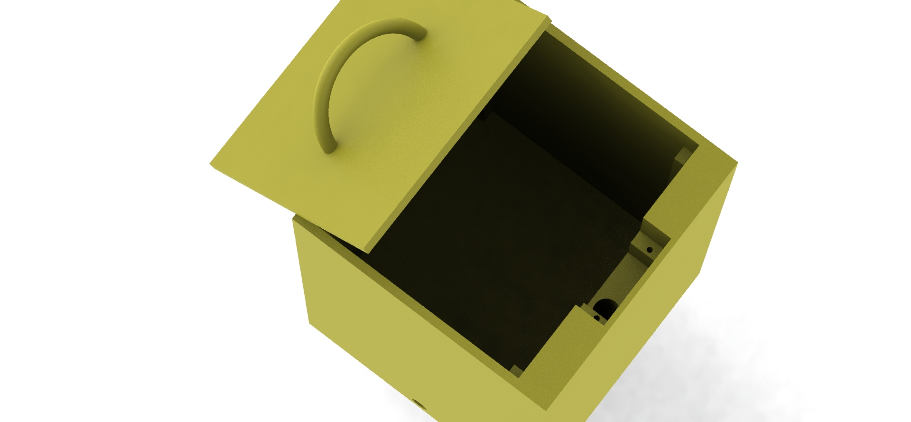
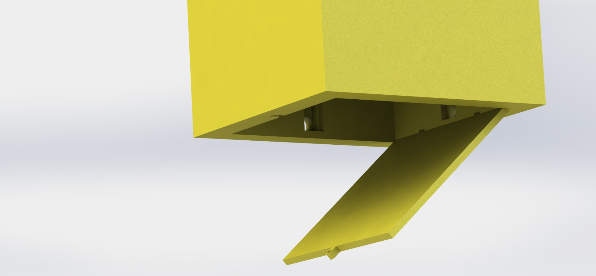

# Spam to unlock box

## How it works 
There's a switch to turn it on and a button on the side. The servo sits in the top, when the servo is closed it prevents the lid from being opened. 
The base houses the arduino as well as room for a removable 9v battery to power everything. In the model for the box there is a cut out hole to feed wires through to the top for the servo, cutouts on the sides to fit a switch and a button. The switch being for power and the button being the push button to unlock the servo.

## Usuage 
### Code / Arduino
For customisation of the code the button pin, required presses, and servo pin are within the first few lines and can be changed as you require.   
```cpp
#include <Servo.h>
#define button_pin 7 // Defined button pin

int butt_req = 100; // Required button presses to unlock
int butt_count = 0;
int butt_state = 0;
int prev_butt_state = 0;
int servoPin = 8; // Servo control pin
Servo servo;  
int servoAngle = 0;
```

### Model

The top has a housing spot for the servo and routing for the wires directly underneath.  

On the base there is room to fit a 9v battery and a arduino micro. There are cutouts to fit a switch and a button on the sides. The switch being for power and the button being the button to be pressed. 
There is also a screw point to seal it shut with a lid.

The entire box is 18cmx10cmx10cm, the length can be changed as required.
